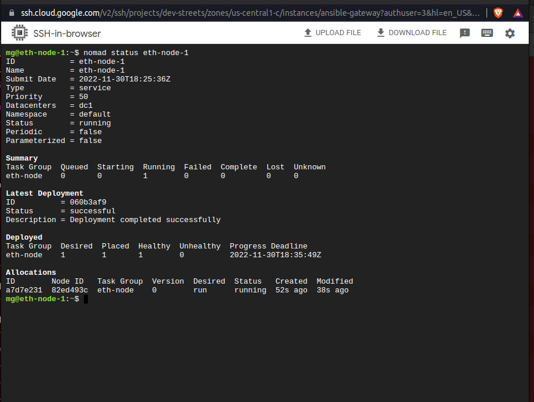
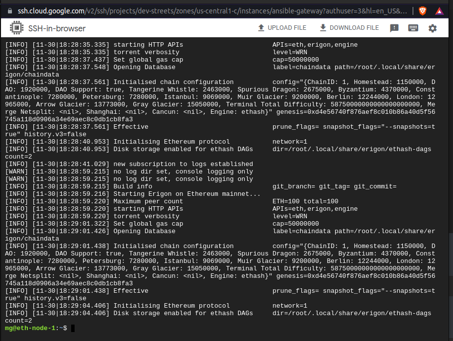
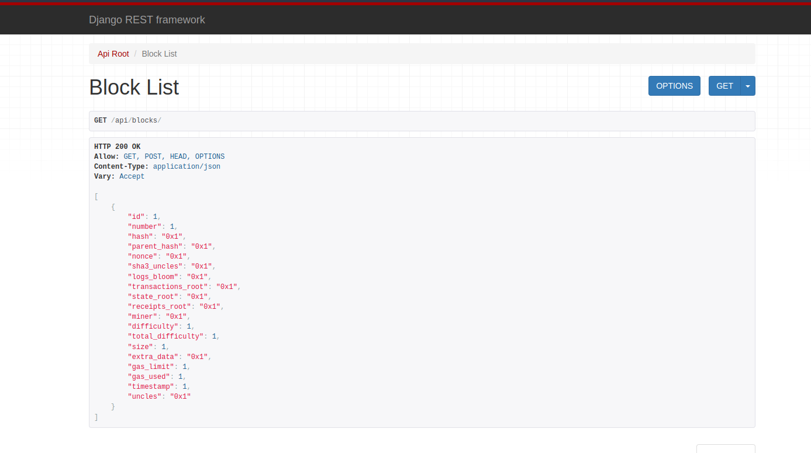

# gateway-demo

## Prerequisite

- A Virtual Machine (a GCP VM instance was used here)
- SSH configuration for the VM

## Usage
### Ethereum Node Deployment

#### Step 1. Clone the repository
```bash
git clone https://github.com/m3rryqold/gateway-demo.git
```
#### Step 2. Navigate to the directory
```bash
cd gateway-demo
```
#### Step 3. Configure the Ansible hosts (inventory) file and vm_user variable in eth-node.yml
```bash
nano ansible/hosts
```
#### Step 4. Run the Ansible playbook
```bash
ansible-playbook ansible/playbook.yml
```
#### Step 5. Check the status of the node
```bash
nomad status eth-node
```
Node Status
#### Step 6. Check the node allocation logs
```bash
nomad logs -stderr -f <alloc-id>
```
Node Allocation Logs
### Django App Usage

#### Step 1. Visit the deployed Django REST API
```
https://django-erigon-merrygold.up.railway.app/
```
#### Step 2. Get sample blocks data
Sample Blocks

#### Step 3. Post sample block data

## Next Steps

- capture block data and stream to Django REST API
- create a React app to display block data
- add Django api to the Nomad cluster
- store block data in Postgres
- automate provisioning of the Nomad cluster with Terraform
- refactor the ansible playbook to use roles
- improve on persistent storage for the Ethereum node